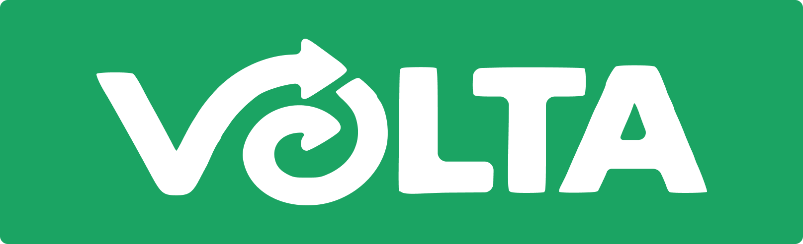
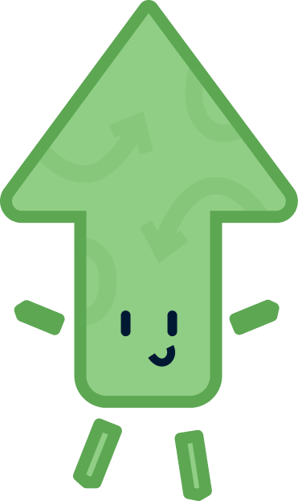
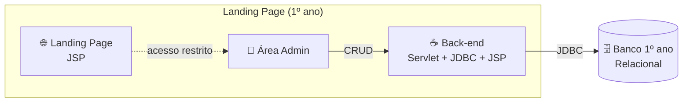
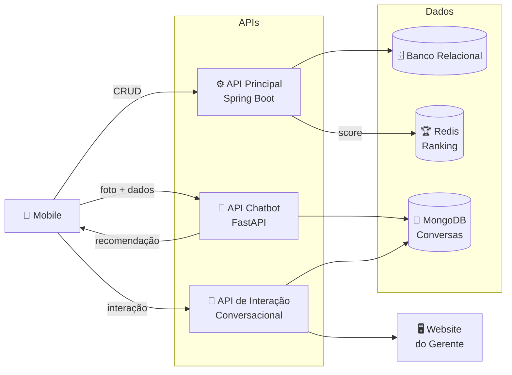
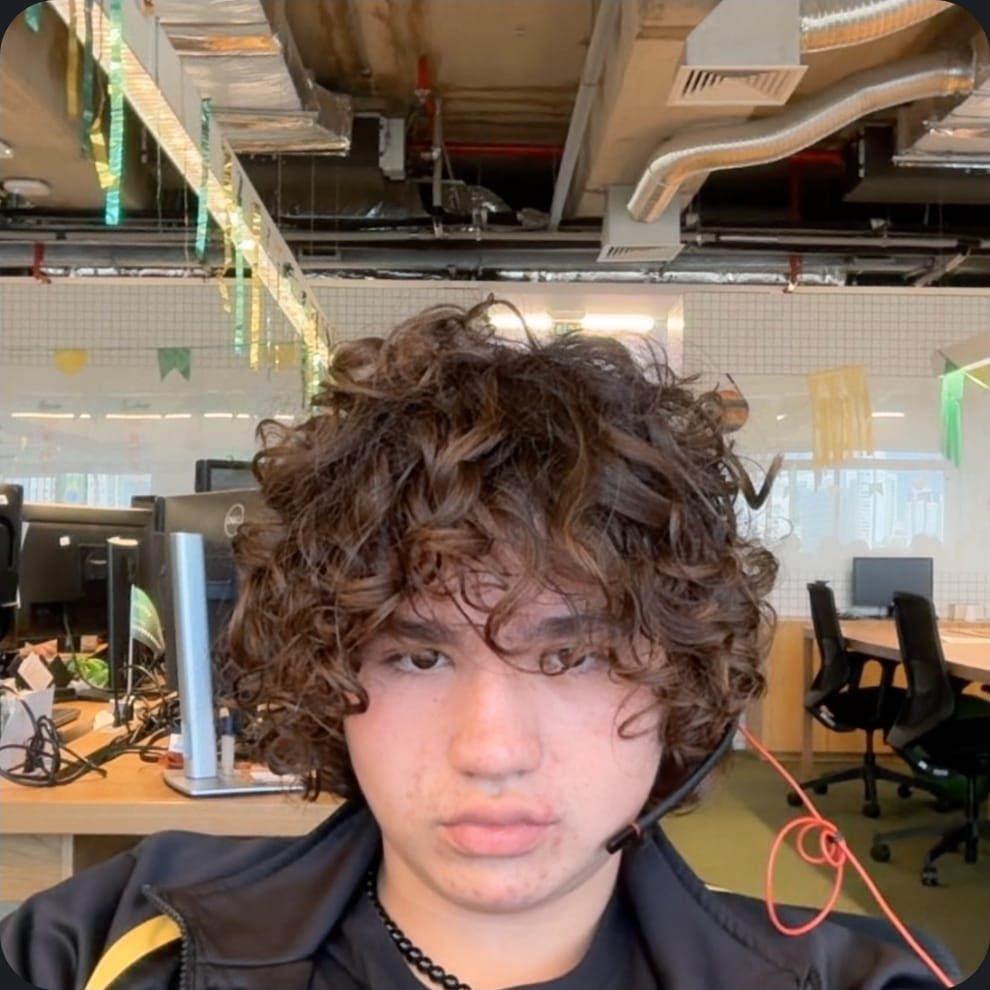

<!-- 

 

 -->

### *"Tira uma foto. O VOLTA cuida do resto."*

[A ideia](#-a-ideia) •
[Como funciona](#-como-funciona) •
[Tecnologias](#-tecnologias) •
[Equipe](#-equipe) •
[Repositórios](#-repositórios)

---

## 💡 A ideia

Muitas empresas ainda têm dificuldade para descartar corretamente os resíduos gerados em suas operações. Hoje esse processo costuma ser **manual, demorado e desorganizado**: WhatsApp, planilhas, e-mails e ligações para tentar encontrar alguém que aceite o material.

O **VOLTA** conecta empresas que geram resíduos industriais a **cooperativas de reciclagem**, trocando a burocracia por um fluxo digital simples:

| 📸 | ➜ | 📋 | ➜ | 🤖 | ➜ | ♻️ |
|:---:|:---:|:---:|:---:|:---:|:---:|:---:|
| **Foto** do resíduo | | **Ocorrência** criada | | **IA** identifica o material | | **Cooperativas** recomendadas |

> Menos burocracia para a empresa, mais destino correto para o resíduo e mais oportunidade de trabalho para as cooperativas.

## 🧩 Como funciona

### Fluxo 1° Ano

### Fluxo 2° Ano

- **Aplicativo mobile** — o colaborador tira a foto e acompanha suas ocorrências.
- **API** — o "cérebro": recebe os dados, conversa com a IA e organiza as recomendações.
- **Banco de dados** — tudo armazenado com segurança e histórico.
- **Landing page** — a vitrine pública do projeto, desenvolvida pelo 1º ano. É isolada do restante do fluxo: não usa as APIs e tem back-end próprio em **Servlet, JDBC e JSP**.
- **Área Admin** *(em desenvolvimento)* — painel com CRUD completo que se conecta direto ao **Banco 1º ano** (relacional, separado do banco da API principal).

Tudo versionado no GitHub e containerizado, pronto para subir na nuvem.

## 🛠️ Tecnologias

**Back-end**

**Inteligência Artificial**

**Dados** 

**Bancos de dados**

**Front-end**

**Mobile**

**Infraestrutura**

**Design**

## 👥 Equipe

O projeto nasce de dois grupos: o **1º ano**, criadores e donos originais da ideia, e o **2º ano**, responsável por desenvolver a solução.

### 🌱 1º Ano — Idealizadores

<table align="center">
  <tr>
    <td align="center"><a href="#"> <b>Miguel Lapa</b></a> Banco de Dados </td>
    <td align="center"><a href="#"> <b>Lucca</b></a> Desenvolvimento I  </td>
    <td align="center"><a href="#"> <b>Gustavo Souza</b></a> Lógica, POO, SO e IA  </td>
    <td align="center"><a href="#"> <b>Gustavo Azenha</b></a> Experiência do Usuário </td>
  </tr>
</table>

### 🚀 2º Ano — Desenvolvedores

<table align="center">
  <tr>
    <td align="center">
    <a href="#"> <b>Lucas Fabiano</b></a> Modelagem & Banco de Dados II    </td>
    <td align="center"><a href="#"> <b>Gabriel Peotta</b></a> IA & Business Intelligence   </td>
    <td align="center"><a href="#"> <b>Enzo Herrera</b></a> Desenvolvimento II & DevOps   </td>
  </tr>
  <tr>
    <td align="center"><a href="#"> <b>Breno</b></a> Aplicações Dinâmicas & UX  </td>
    <td align="center"><a href="#"> <b>Carlos Amaral</b></a> Mobile  </td>
    <td align="center"><a href="#"> <b>Davi Liu</b></a> Eng. de Software & UX  </td>
  </tr>
</table>

## 📦 Repositórios

Todo o código vive na organização **[app-volta](https://github.com/app-volta)**:

| | Repositório | O que contém |
|:---:|---|---|
| 📱 | [volta-mobile](https://github.com/app-volta/volta-mobile) | Aplicativo mobile (Android nativo) |
| ⚙️ | [volta-api](https://github.com/app-volta/volta-api) | API principal do sistema (Spring Boot) |
| 🏆 | [volta-api-redis](https://github.com/app-volta/volta-api-redis) | API para ranking dinâmico (Redis) |
| 💬 | [volta-api-mongo](https://github.com/app-volta/volta-api-mongo) | API para interação conversacional (MongoDB, FastAPI) |
| 🗄️ | [volta-database](https://github.com/app-volta/volta-database) | Modelagem e banco de dados relacional (SQL) |
| 🤖 | [volta-chatbot](https://github.com/app-volta/volta-chatbot) | Módulo de Inteligência Artificial (FastAPI) |
| 📊 | [volta-business-inteligence](https://github.com/app-volta/volta-business-inteligence) | Análises e dashboards de BI |
| 🌐 | [volta-landing-page](https://github.com/app-volta/volta-landing-page) | Página/aplicação web do projeto |
| 🖥️ | [volta-website-dad](https://github.com/app-volta/volta-website-dad) | Website para uso do gerente |
| 🐳 | [volta-devops](https://github.com/app-volta/volta-devops) | Infraestrutura, containers e deploy |
| 📚 | [volta-docs](https://github.com/app-volta/volta-docs) | Documentação, diagramas e metodologia |
| 🔧 | [.github](https://github.com/app-volta/.github) | Configurações padrão da organização |

> Cada repositório é mantido pela frente correspondente da equipe.

---

**Quer entender a fundo?** Arquitetura, funcionalidades e regras de negócio estão em [volta-docs](https://github.com/app-volta/volta-docs).

Feito com 💚 pela equipe VOLTA — porque todo resíduo merece uma segunda volta. ♻️

